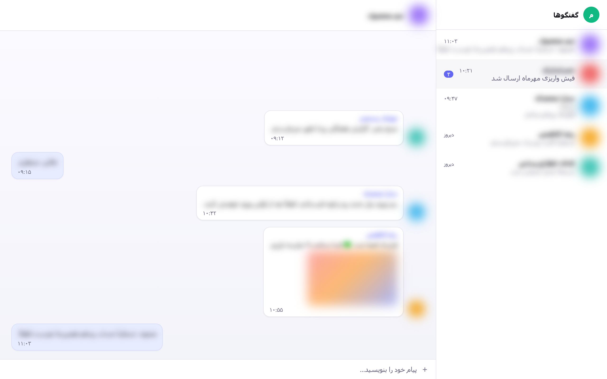

<div align="center">
  
  <h1>حریم خصوصی برای وب بله</h1>
  <p><strong>گفتگوها، پیش‌نمایش‌ها، عکس‌ها و تصاویر پروفایل را در <a href="https://web.bale.ai/chat">web.bale.ai</a> محو نگه دارید تا وقتی واقعاً به خواندنشان نیاز دارید.</strong></p>
  <p>
    <a href="README.md">English</a> · <strong>فارسی</strong>
  </p>
  <p>
    <a href="https://amiranmanesh.github.io/bale-privacy-extension/fa/">وب‌سایت</a> ·
    <a href="https://github.com/amiranmanesh/bale-privacy-extension/wiki">ویکی</a> ·
    <a href="#نصب">نصب</a> ·
    <a href="https://amiranmanesh.github.io/bale-privacy-extension/fa/privacy.html">حریم خصوصی</a>
  </p>
  <p>
    <a href="https://github.com/amiranmanesh/bale-privacy-extension/actions/workflows/ci.yml"></a>
    <a href="https://addons.mozilla.org/fa/firefox/addon/privacy-for-bale-web/"></a>
    
    
    <a href="LICENSE"></a>
  </p>
</div>

<p align="center">
  
</p>
<p align="center"><sub>با بردن نشانگر روی یک ردیف، فقط همان ردیف خوانا می‌شود. همهٔ محتوای تصویر ساختگی است.</sub></p>

---

<div dir="rtl">

وقتی وب بله را در کافه، دفتر کار مشترک یا هنگام اشتراک‌گذاری صفحه باز می‌کنید، هر کسی که
پشت سرتان است می‌تواند گفتگوهایتان را بخواند. این افزونه رابط کاربری را قابل استفاده نگه
می‌دارد ولی هر چیزی را که واقعاً خصوصی است محو می‌کند، و با بردن نشانگر روی هر عنصر، همان
یکی خوانا می‌شود.

پروژه‌ای مستقل و متن‌باز است. وابسته به بله **نیست** و از سوی آن تأیید نشده است.

## قابلیت‌ها

|                                               |                                                                                                                                                                                              |
| --------------------------------------------- | -------------------------------------------------------------------------------------------------------------------------------------------------------------------------------------------- |
| **محو کردن آنچه اهمیت دارد**                  | نام و پیش‌نمایش گفتگوها، سربرگ گفتگو، متن پیام‌ها، عکس و ویدیو و استیکر، آواتار فرستنده و فهرست، پنل پروفایل، و در صورت تمایل متنی که در حال نوشتنش هستید. هر دسته سوییچ مستقل خودش را دارد. |
| **نمایش با نشانگر**                           | نشانگر را روی یک عنصر محوشده ببرید تا خوانا شود؛ با تأخیر قابل تنظیم تا تصادفی چیزی آشکار نشود.                                                                                              |
| **نگه داشتن کلید**                            | کلید Alt (یا Ctrl / Shift) را نگه دارید تا تا وقتی پایین است، کل صفحه آشکار شود.                                                                                                             |
| **محو خودکار وقتی رو برمی‌گردانید**           | به‌محض خارج شدن پنجره از حالت فعال، یا پس از مدتی بی‌کاری، دوباره محو می‌شود. هر دو کلید اصلی را نادیده می‌گیرند.                                                                            |
| **یک میان‌بر**                                | <kbd>Alt</kbd>+<kbd>Shift</kbd>+<kbd>B</kbd> محو کردن را در همهٔ تب‌های باز روشن یا خاموش می‌کند.                                                                                            |
| **بدون نشت تولتیپ**                           | بله پیش‌نمایش پیام را در اتریبیوت `title` نگه می‌دارد؛ افزونه آن تولتیپ بومی را تا وقتی متن باید پنهان بماند مهار می‌کند.                                                                    |
| **در برابر به‌روزرسانی‌های بله دوام می‌آورد** | کلاس‌های CSS بله در هر بیلد هش می‌شوند، پس افزونه روی اتریبیوت‌های پایدار تکیه می‌کند — و اگر روزی چیزی از قلم افتاد، خودتان می‌توانید از صفحهٔ تنظیمات سلکتور اضافه کنید.                   |
| **هیچ چیز از مرورگر شما بیرون نمی‌رود**       | یک مجوز (`storage`)، بدون host permission، بدون درخواست شبکه‌ای، بدون آنالیتیکس، بدون کد از راه دور.                                                                                         |
| **انگلیسی و فارسی**                           | رابط کاربری کاملاً راست‌به‌چپ.                                                                                                                                                               |

### عمداً خوانا می‌مانند

ساعت پیام‌ها، شمارندهٔ پیام‌های نخوانده و تعداد پاسخ‌ها. این‌ها چیز خصوصی‌ای لو نمی‌دهند و
نبودشان صفحه را غیرقابل استفاده می‌کند.

<h2 id="نصب">نصب</h2>

### کدام مرورگرها

| مرورگر                                           | بسته                                                                                                        |
| ------------------------------------------------ | ----------------------------------------------------------------------------------------------------------- |
| کروم، اج، بریو، اپرا، ویوالدی، آرک (۱۱۱ به بالا) | `…-chrome.zip` — یک بسته برای همهٔ مرورگرهای کرومیومی                                                       |
| فایرفاکس ۱۲۱ به بالا، فایرفاکس اندروید           | `…-firefox.zip`                                                                                             |
| سافاری ۱۶٫۴ به بالا روی مک                       | از همین کد با `npm run build:safari` ساخته می‌شود؛ به Xcode و برای انتشار به حساب Apple Developer نیاز دارد |

مرورگرهای کرومیومی به بستهٔ جداگانه نیاز ندارند — فقط لیست فروشگاهشان جداست.
جزئیات و این‌که روی هر موتور دقیقاً چه چیزی تست شده:
[docs/BROWSER-SUPPORT.md](docs/BROWSER-SUPPORT.md).

### از فروشگاه‌ها

**فایرفاکس — [افزودن به فایرفاکس](https://addons.mozilla.org/fa/firefox/addon/privacy-for-bale-web/)**

روی addons.mozilla.org منتشر شده و موزیلا آن را بررسی کرده است. راه درست همین است: افزونه با
بستن مرورگر پاک نمی‌شود و خودش به‌روز می‌شود.

**کروم، اِج، اپرا** — هنوز ارسال نشده. تا آن موقع از
[بسته‌های ریلیز](#از-روی-ریلیز-بدون-نیاز-به-ابزار-توسعه) استفاده کنید؛ دقیقاً همان فایلی است
که به فروشگاه می‌رود.

### از روی ریلیز (بدون نیاز به ابزار توسعه)

هر تگ، بستهٔ آمادهٔ نصب را در
[صفحهٔ ریلیزها](https://github.com/amiranmanesh/bale-privacy-extension/releases) منتشر
می‌کند — دقیقاً همان فایلی که به فروشگاه‌ها می‌رود و توسط CI از روی کد تگ‌خورده ساخته شده.

**کروم، اِج، بریو، اپرا**

1. فایل `bale-privacy-<version>-chrome.zip` را از
   [آخرین ریلیز](https://github.com/amiranmanesh/bale-privacy-extension/releases/latest)
   دانلود کنید.
2. از حالت فشرده خارجش کنید و پوشهٔ حاصل را جایی ثابت بگذارید — مثلاً در Documents. کروم
   هر بار که باز می‌شود افزونه را از همان مسیر می‌خواند؛ اگر پوشه را پاک یا جابه‌جا کنید،
   افزونه از کار می‌افتد.
3. آدرس `chrome://extensions` را باز کنید (اِج: `edge://extensions`، بریو:
   `brave://extensions`).
4. گزینهٔ **Developer mode** را در گوشهٔ بالا روشن کنید.
5. روی **Load unpacked** بزنید و همان پوشهٔ استخراج‌شده را انتخاب کنید — پوشه‌ای که فایل
   `manifest.json` داخلش است.
6. اختیاری: روی آیکون پازل در نوار ابزار بزنید و افزونه را pin کنید.
7. <https://web.bale.ai/chat> را باز کنید. محو کردن از ابتدا روشن است.

**فایرفاکس** — به‌جای این روش، افزونه را
[از addons.mozilla.org](https://addons.mozilla.org/fa/firefox/addon/privacy-for-bale-web/) نصب
کنید. نصب دستی فقط وقتی لازم است که بخواهید نسخهٔ خاصی یا بیلد خودتان را امتحان کنید:

1. فایل `bale-privacy-<version>-firefox.zip` را از
   [آخرین ریلیز](https://github.com/amiranmanesh/bale-privacy-extension/releases/latest)
   دانلود کنید.
2. آدرس `about:debugging#/runtime/this-firefox` را باز کنید.
3. روی **Load Temporary Add-on…** بزنید و خودِ فایل ZIP را انتخاب کنید.
4. <https://web.bale.ai/chat> را باز کنید.

فایرفاکس افزونه‌های موقت را با بسته شدن مرورگر حذف می‌کند، پس این کار را هر بار باید تکرار
کنید — دلیل دیگری برای این‌که نسخهٔ امضاشده را از
[addons.mozilla.org](https://addons.mozilla.org/fa/firefox/addon/privacy-for-bale-web/) نصب کنید.

### ساخت از روی کد

```bash
git clone https://github.com/amiranmanesh/bale-privacy-extension.git bale-privacy
cd bale-privacy
npm install
npm run build          # dist/chrome و dist/firefox را می‌سازد
```

سپس `dist/chrome` یا `dist/firefox` را با همان مراحل بالا بارگذاری کنید. بعد از هر بیلد
جدید، روی کارت افزونه دکمهٔ reload را بزنید و تب بله را هم رفرش کنید.

## استفاده

- روی آیکون افزونه در نوار ابزار بزنید تا سوییچ‌های سریع را ببینید؛ **همهٔ تنظیمات**
  صفحهٔ کامل را باز می‌کند.
- <kbd>Alt</kbd>+<kbd>Shift</kbd>+<kbd>B</kbd> محو کردن را روشن و خاموش می‌کند. برای
  تغییرش: `chrome://extensions/shortcuts` یا در فایرفاکس `about:addons` ←
  _Manage Extension Shortcuts_.
- نشانگر را روی هر عنصر محوشده ببرید تا فقط همان یکی خوانا شود.

## چطور کار می‌کند

افزونه یک استایل‌شیت و یک اتریبیوت روی `<html>` اضافه می‌کند:

```html
<html data-bale-privacy="active animate hover messageText messageMedia …"></html>
```

همهٔ قوانین استایل به همین توکن‌ها گره خورده‌اند، پس تغییر یک دسته، بردن نشانگر، نگه داشتن
کلید یا تغییر شدت محو فقط یک اتریبیوت یا یک متغیر CSS را بازنویسی می‌کند. هیچ کدی روی
تک‌تک عناصر اجرا نمی‌شود و هیچ `MutationObserver` روی فهرست پیام‌ها نیست — به همین دلیل
پیام تازه همان لحظهٔ رندر محو است و تب باز عملاً هیچ هزینه‌ای ندارد.

توضیح کامل در [docs/ARCHITECTURE.md](docs/ARCHITECTURE.md)، و روش استخراج و تعمیر
سلکتورها در [docs/SELECTORS.md](docs/SELECTORS.md).

## مجوزها

| مجوز                                       | چرا                                                                   |
| ------------------------------------------ | --------------------------------------------------------------------- |
| `storage`                                  | ذخیرهٔ تنظیمات، و اطلاع دادن به همهٔ تب‌های باز وقتی چیزی عوض می‌شود. |
| content script روی `https://web.bale.ai/*` | تنها سایتی که افزونه تغییرش می‌دهد.                                   |

بدون host permission، بدون `tabs`، بدون `activeTab`. تنظیمات در فضای ذخیره‌سازی مرورگر
می‌ماند؛ اگر همگام‌سازی مرورگرتان روشن باشد، خودِ مرورگر آن را بین دستگاه‌های شما جابه‌جا
می‌کند. متن کامل:
[سیاست حریم خصوصی](https://amiranmanesh.github.io/bale-privacy-extension/fa/privacy.html).

## مستندات

|                                                                                             |                                               |
| ------------------------------------------------------------------------------------------- | --------------------------------------------- |
| [وب‌سایت](https://amiranmanesh.github.io/bale-privacy-extension/fa/)                        | معرفی، تصاویر، نصب                            |
| [ویکی](https://github.com/amiranmanesh/bale-privacy-extension/wiki)                         | نصب، همهٔ تنظیمات، عیب‌یابی، پرسش‌های پرتکرار |
| [مرجع تنظیمات](https://github.com/amiranmanesh/bale-privacy-extension/wiki/راهنمای-تنظیمات) | هر سوییچ چه چیزی را می‌پوشاند                 |
| [رفع مشکل](https://github.com/amiranmanesh/bale-privacy-extension/wiki/رفع-مشکل)            | اگر چیزی درست کار نکرد، از اینجا شروع کنید    |

## مشارکت

گزارش اینکه یک دسته بعد از به‌روزرسانی بله دیگر محو نمی‌شود، مفیدترین چیزی است که
می‌توانید بفرستید —
[فرم‌های ایشو](https://github.com/amiranmanesh/bale-privacy-extension/issues/new/choose)
دقیقاً همان اطلاعاتی را می‌خواهند که فیکس را یک‌خطی می‌کند. هر دو ابزار تشخیصی، متن پیام‌ها
را قبل از چاپ با `«N chars»` جایگزین می‌کنند، پس خروجی‌شان امن است.

## مجوز

[MIT](LICENSE).

</div>
